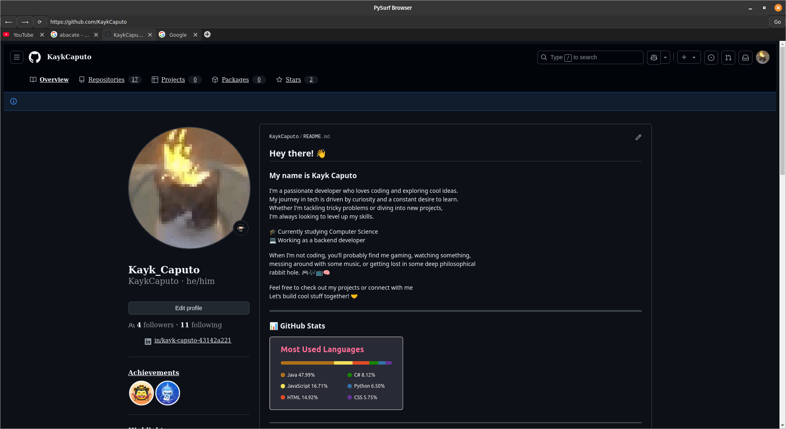

# 🌐 PySurf

<p align="center">
  
</p>

**PySurf** is a lightweight, minimalist open-source web browser built with **Python** and **PyQt5**. It combines simplicity with extensibility.

---

## 📸 Screenshot



---

## 🚀 Features

- 🧭 Tabbed browsing
- 🔗 Functional address bar
- 🖥️ Page rendering via **QtWebEngine**
- 🧱 Modular architecture with clean widget separation

---

## 🧰 Built With

- [Python 3.10+](https://www.python.org/)
- [PyQt5](https://pypi.org/project/PyQt5/)
- [PyQtWebEngine](https://pypi.org/project/PyQtWebEngine/)

---

## 🌱 Running

```bash
cd dist
./main
```

---

## 🛠️ Installation

### 1. Clone the repository

```bash
git clone https://github.com/your-username/PySurf.git
cd PySurf
```

### 2. (Optional) Create a virtual environment

```bash
python3 -m venv .venv
source .venv/bin/activate  # Linux/macOS
# or
.venv\Scripts\activate     # Windows
```

### 3. Install dependencies

```bash
pip install -r requirements.txt
```

### 4. Run the browser

```bash
python src/main.py
```

---

## 💡 Roadmap

- Full integration with native Chromium DevTools
- Bookmark support
- Browsing history
- Light/Dark themes
- Extension system

---

## 🤝 Contributing

Contributions are very welcome! Feel free to open issues, suggest features, or submit pull requests.

---

## 📄 License

This project is licensed under the **MIT License**

---

## 🧑‍💻 Author

Made with 💻 by **KaykCaputo**  
[GitHub](https://github.com/KaykCaputo)
